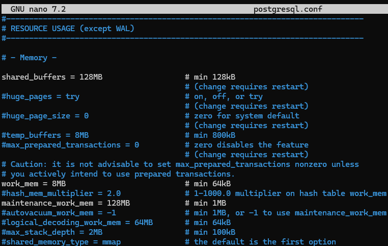
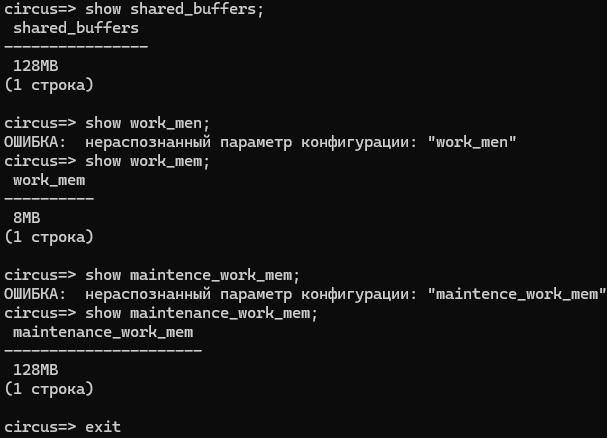
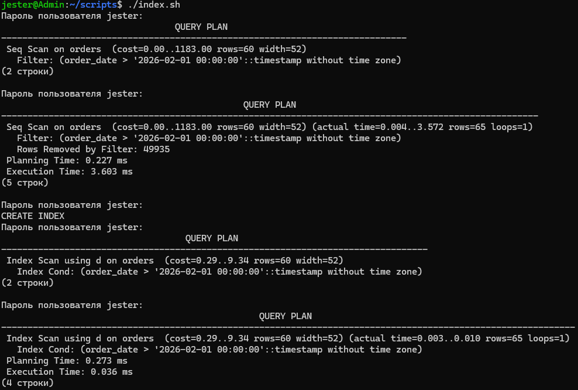
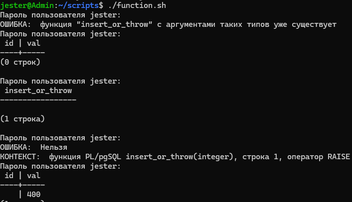
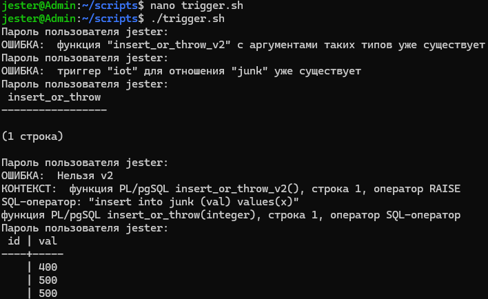
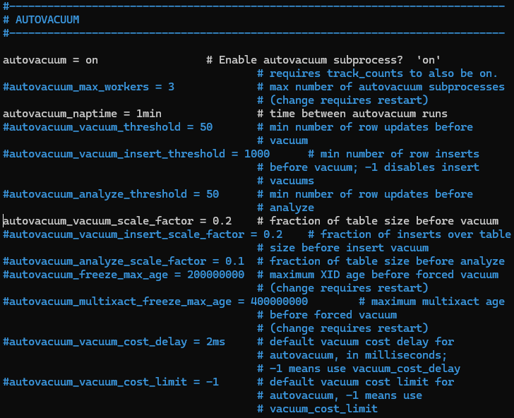
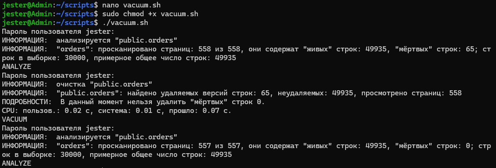
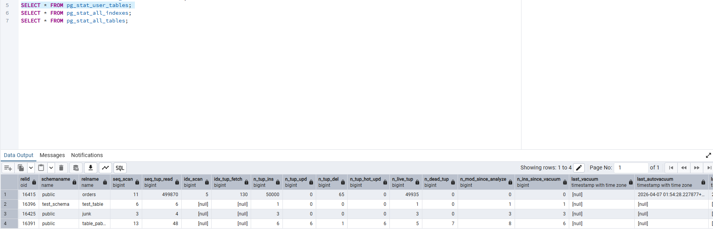
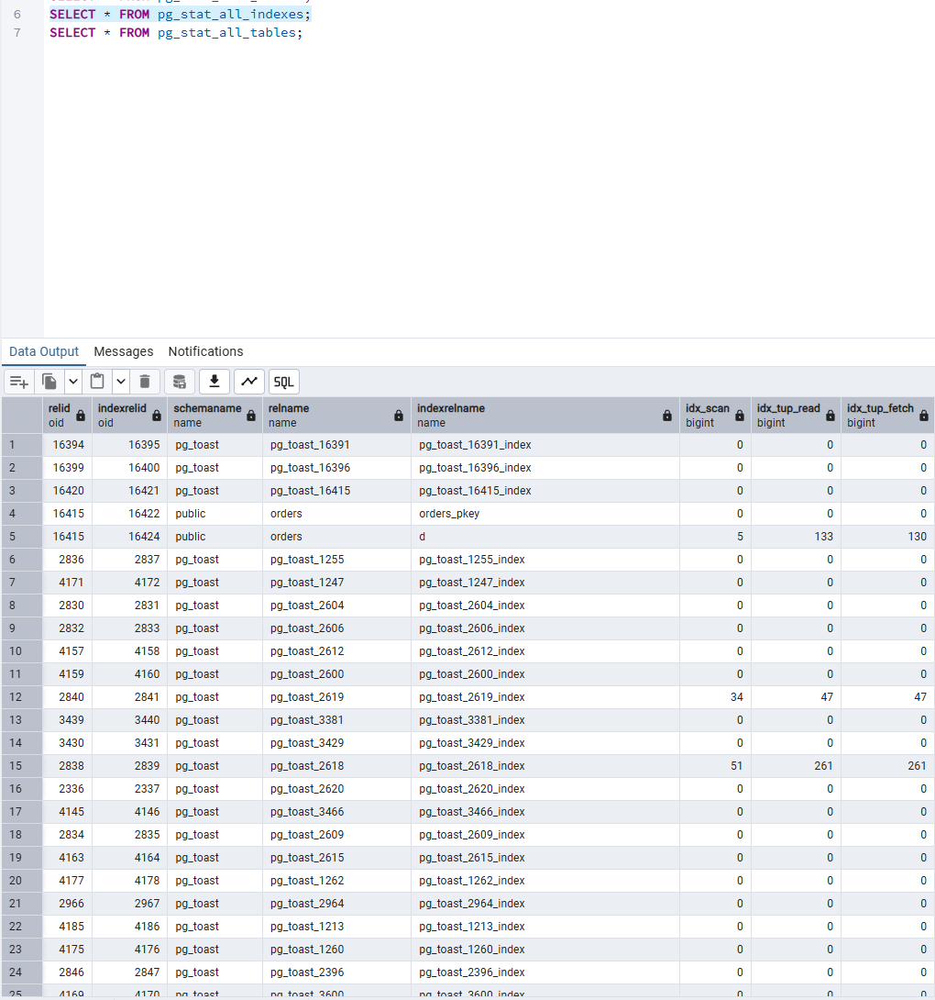
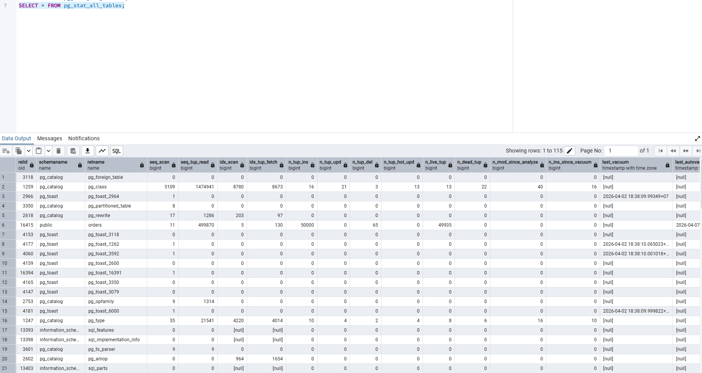

# Лабораторная работа №3: Расширенные возможности и оптимизации PostgreSQL на Debian

## Выполнил: Матурин Роман студент группы ИС-22

## Цель: Изучить способы резервного копирования баз данных PostgreSQL и восстановления их в среде Debian. Освоить базовые инструменты мониторинга системы и сервиса PostgreSQL.

# Ход выполнения

## 1. Оптимизация конфигурации PostgreSQL

В данному пункте нужно было найти в postgresql.conf параметры, влияющие на производительность: shared_buffers, work_mem, maintenance_work_mem, effective_cache_size.

Параметры конфигурации PostgreSQL напрямую влияют на производительность работы базы данных и использование оперативной памяти. Параметр shared_buffers определяет объём оперативной памяти, выделяемой PostgreSQL для кэширования данных и индексов. Параметр work_mem задаёт объём памяти, выделяемый на выполнение операций сортировки, хеширования и объединения таблиц для каждого отдельного запроса. Параметр maintenance_work_mem используется при выполнении обслуживающих операций, таких как создание индексов, операции VACUUM и ALTER TABLE. Параметр effective_cache_size представляет собой оценку объёма памяти, доступной для кэширования (включая кэш операционной системы), и используется планировщиком запросов для выбора наиболее эффективного плана выполнения, не выделяя память напрямую.

По заданию нужно было установить значения с учётом объёма оперативной памяти виртуальной машины. Так как для выполнения лабораторной работы использовалась виртуальная машина с оперативной памятью 2 ГБ, параметры PostgreSQL были настроены так:

- Параметр shared_buffers установлен 512MB, так как для эффективного кэширования данных и уменьшения количества обращений к диску нужно примерно 25% от общего объёма оперативной памяти.

- Параметр work_mem установлен 8MB, было выбрано умеренное значение, чтобы избежать переполнения оперативной памяти при одновременном выполнении нескольких запросов.

- Параметр maintenance_work_mem установлен 128MB. Это значение было увеличено, чтобы ускорить выполнение служебных операций, но при этом не занимать слишком много памяти.




После изменения сервер PostgreSQL был перезапущен и также была произведена проверка выставленных параметров. Значения применились корректно.



## 2. Создание и анализ индексов

Для анализа производительности запросов была использована таблица test. Были добавлены новые данные с помощью команды 
``` sql
CREATE TABLE orders (
    id serial PRIMARY KEY,
    order_name text NOT NULL,
    order_date timestamp NOT NULL DEFAULT now(),
    amount integer NOT NULL
);

INSERT INTO orders (order_name, order_date, amount)
SELECT 
    'Тестовый заказ №' || i AS order_name,
    NOW() - (i * INTERVAL '1 day') AS order_date,
    (RANDOM() * 10000)::INT AS amount
FROM generate_series(1, 50000) AS i;
```

Данная функция позволяет сгенерировать последовательность чисел в заданном диапазоне и автоматически создать большое количество строк, что удобно для тестирования производительности базы данных и анализа работы запросов на больших объёмах данных.

До создания индекса при выполнении запроса *explain analyze select * from orders where \"order_date\" > '2026-02-01';* использовался план выполнения Seq Scan (последовательное сканирование). PostgreSQL просматривает все строки таблицы одну за другой, проверяя для каждой строки выполнение условия *\"order_date\" > '2026-02-01'*. Такой способ не использует никаких вспомогательных структур, поэтому время выполнения напрямую зависит от размера таблицы: чем больше строк, тем дольше выполняется запрос.

После создания индекса с помощью команды *create index \"d\" on orders(order_date);* план выполнения изменился на Index Scan. Это означает, что PostgreSQL использует индекс для поиска нужных строк, что значительно сокращает время выполнения запроса.



Как видно из результатов использование индексов позволяет существенно повысить производительность запросов, особенно при работе с большими таблицами.

## 3. Хранимые функции

В данном пункте нужно было создать функцию на pgSQL, которая проверяет переданное значение и в зависимости от результата либо вставляет новую запись в таблицу, либо возвращает сообщение об ошибке.

Была реализована функция, которая принимает значения идентификатора и имени, после чего с помощью оператора *if* проверяет корректность переданных данных. В случае успешного прохождения проверки выполняется вставка новой записи в таблицу junk, и функция возвращает сообщение «Запись добавлена». При не прохождении условия, функция возвращает сообщение об ошибке "Ошибка. val < 99".

После создания функции, она была вызвана для проверки корректной работы. Также была произведена проверка выдачи сообщения об ошибке, если данные не корректные.




## 4. Триггеры

В данном пункте нужно было создать триггер, который проверяет бизнесправила. При нарушении условий вызвать RAISE EXCEPTION.

Была создана триггерная функция, в которой реализовано правило проверки: значение не должно быть < 400. С помощью оператора RAISE EXCEPTION было реализовано прерывание выполнения операции вставки или обновления в зависимости от выполнения условия.

После этого был создан триггер типа BEFORE INSERT OR UPDATE, который срабатывает перед добавлением или изменением строки и вызывает функцию проверки созданную ранее.

После была произведена проверка работы триггера, было получено корректное сообщение. Реализованный триггер обеспечивает автоматический контроль корректности данных на уровне базы данных, предотвращая запись недопустимых значений в таблицу и поддерживая целостность хранимой информации.



## 5. Автоматическая очистка и статистика (VACUUM, ANALYZE)

В последнем пункте нужно было изучить параметры autovacuum (autovacuum_naptime, autovacuum_vacuum_scale_factor), убедиться, что autovacuum включён, выполнить VACUUM ANALYZE для одной или нескольких таблиц и изучить представления pg_stat_user_tables, pg_stat_all_indexes и другие.

Параметры autovacuum отвечают за настройку автоматической очистки таблиц от «мёртвых» строк и актуализацию статистики для оптимизатора запросов в PostgreSQL. autovacuum_naptime — определяет интервал времени между запусками процесса autovacuum. autovacuum_vacuum_scale_factor — задаёт порог в долях изменённых строк, после которого для таблицы автоматически запускается VACUUM. Эти параметры позволяют поддерживать таблицы в актуальном состоянии без ручного вмешательства, предотвращая разрастание базы данных и ухудшение производительности запросов. Была произведена проверка работы autovacuum.




Далее для таблицы orders была выполнена команда VACUUM ANALYZE, которая обеспечивает удаление устаревших версий строк и обновление статистики, используемой оптимизатором запросов. VACUUM выполняет очистку устаревших версий записей, которые остаются после операций UPDATE и DELETE. Удаление таких строк освобождает пространство в таблице, предотвращает её разрастание. ANALYZE собирает статистику о содержимом таблиц и индексов, включая распределение значений в столбцах и количество строк. Эти данные используются оптимизатором PostgreSQL для построения эффективных планов выполнения запросов, позволяя СУБД выбирать наиболее быстрые способы доступа к данным.

Значение VACUUM после выполнения команды обозначает успешное завершение операции.



Также были исследованы системные представления pg_stat_user_tables, pg_stat_all_indexes и pg_stat_all_tables, которые позволяют отслеживать состояние таблиц и индексов, а также работу механизма autovacuum.

Представление pg_stat_user_tables содержит статистику по пользовательским таблицам: relname – имя таблицы, n_live_tup – количество актуальных записей, которые доступны для чтения и использования в запросах. n_dead_tup – количество устаревших версий записей после операций UPDATE или DELETE, которые ещё не были очищены VACUUM. vacuum_count – число выполненных ручных VACUUM для данной таблицы. autovacuum_count – число срабатываний автоматического VACUUM для таблицы.

Представление pg_stat_all_indexes содержит статистику по всем индексам в базе данных, включая имя индекса (indexrelname) и количество его сканирований (idx_scan). Выполненный запрос для схемы public позволяет определить, какие индексы используются в запросах и насколько активно к ним обращается оптимизатор при выполнении операций с таблицами.

Представление pg_stat_all_tables показывает статистику по всем таблицам базы данных, включая пользовательские и системные, и позволяет отслеживать работу VACUUM и ANALYZE. Столбцы: relname – имя таблицы, к которой относятся статистические данные. vacuum_count – количество выполненных ручных VACUUM для данной таблицы. autovacuum_count – количество выполненных автоматических VACUUM. analyze_count – число выполненных ручных операций ANALYZE, которые обновляют статистику таблицы. last_vacuum – время последнего выполнения ручного VACUUM для таблицы. last_autovacuum – время последнего выполнения автоматического VACUUM через механизм autovacuum.








## Вывод:
 в ходе выполнения лабораторной работы были изучены продвинутые возможности PostgreSQL на Debian, включая настройку параметров сервера (shared_buffers, work_mem, maintenance_work_mem, effective_cache_size) для оптимизации производительности, генерацию больших объёмов данных в таблице table_public, создание и анализ индексов с использованием EXPLAIN ANALYZE, разработка хранимой функции и триггера для проверки корректности данных, а также изучение и настройка механизма autovacuum и выполнение VACUUM ANALYZE. Дополнительно исследованы системные представления pg_stat_user_tables, pg_stat_all_indexes и pg_stat_all_tables для мониторинга состояния таблиц и индексов. В результате были получены практические навыки настройки, оптимизации, контроля целостности данных и мониторинга работы PostgreSQL.
